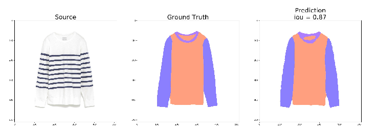
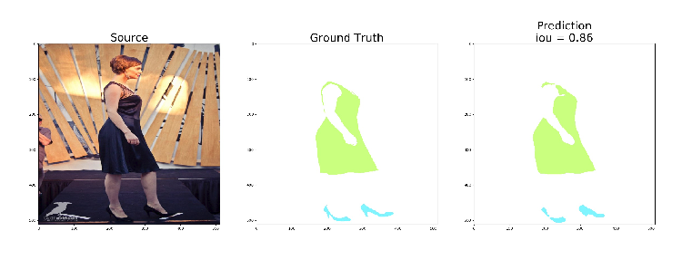

### 
В рамках курсовой работы  реализована гибкая система для проведения вычислительных экспериметов по решению сегментационных задач,
в которой предусмотрены следующие возможности: 
- выбор архитектуры нейронной сети
- выбор функции потерь (можно использовать сумму нескольких функций потерь с заданными коэффициентами)
- использование mixup-аугментации
- использование weight_decay штрафования весов
- выбор расписания темпа обучения с возможностью задать параметры расписания: полиномиальный или циклический
- определение наилучших максимальных и минимальных границ для темпа обучения при циклическом
расписании
- возможность решать задачи, в которых классы могут пересекаться
- логирование большого количества метрик обучения в Tensorboard
- выбор видеокарты при запуске эксперимента

Проект разработан на Python v3.7, torch v1.0, для запуска необходимо наличие видеокарты.

### Рассматриваемые архитектуры:
- [Unet](https://arxiv.org/abs/1505.04597)
- [Bisenet](https://arxiv.org/abs/1808.00897)
- Экспериментальная архитектура, разработанная на основании 
[обратимых нейронных сетей](https://github.com/silvandeleemput/memcnn)

### Примеры результатов
Примеры результатов, полученных для набора данных, предлагавшихся в Kaggle-соревновании 
[iMaterialist (Fashion) 2019 at FGVC6 ](https://www.kaggle.com/c/imaterialist-fashion-2019-FGVC6).

### Благодарности
Работа была написана под руководством [Алексея Озерина](https://github.com/m12sl).

В работе используются материалы проектов, доступных в соответствии с MIT лицензией:
 - [MemCNN](https://github.com/silvandeleemput/memcnn)
 - [TorchSeg](https://github.com/ycszen/TorchSeg)
 